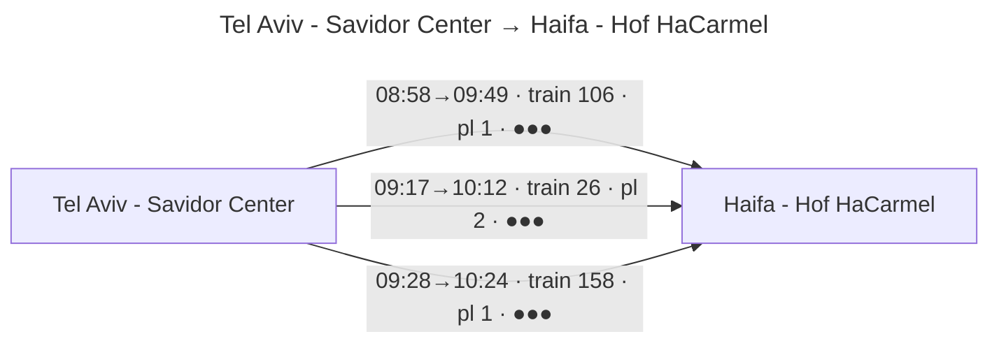

# rakevet 🚆

> *rakevet* (רכבת) — Hebrew for "train".

Browse **Israel Railways** ([rail.co.il](https://www.rail.co.il/?lan=he)) without leaving your editor — next departures, routes, platforms and crowding. rakevet ships as an **Agent Skill** for **Claude Code** and **Cursor**: a tiny, zero-dependency engine that talks directly to the same backend the website uses (`rail-api.rail.co.il`), wrapped in a [`SKILL.md`](skills/rakevet/SKILL.md) that drives it.

The skill adapts its output to the host:

- **Cursor / the Claude desktop & web apps** → the journey is drawn as a **Mermaid diagram** (stations as nodes, each train leg a labelled arrow).
- **Claude Code / a plain terminal** → an **ASCII table**.

It's also a normal **CLI** if you just want it on your `PATH`.

🌐 **Docs site:** https://yonidavidson.github.io/rakevet/


…and in a diagram-capable host (Cursor, the Claude apps), the same query renders as:



## Requirements

- **Node.js ≥ 22.6** — the engine is TypeScript run natively by Node. No build step, no `npm install`, no dependencies.

## Install as a skill

Clone once, then make the skill visible to your tool. The same `skills/rakevet/` folder works everywhere.

```bash
git clone https://github.com/yonidavidson/rakevet.git
```

### Claude Code

Either install the whole repo as a **plugin**:

```
/plugin marketplace add yonidavidson/rakevet
/plugin install rakevet@rakevet
```

…or drop just the skill into your skills folder:

```bash
ln -s "$PWD/rakevet/skills/rakevet" ~/.claude/skills/rakevet
```

### Cursor

Cursor auto-loads skills from `.cursor/skills/` (project) and also from `.claude/skills/`. Symlink the skill into either — for a global install:

```bash
mkdir -p ~/.claude/skills
ln -s "$PWD/rakevet/skills/rakevet" ~/.claude/skills/rakevet
```

…or per-project: `ln -s …/skills/rakevet your-project/.cursor/skills/rakevet`.

Then just ask, naturally:

> *when's the next train from Tel Aviv to Haifa?*
> *trains from Nahariya to Jerusalem around 9am tomorrow — which platform?*

The skill resolves the stations, fetches live times, and renders a Mermaid diagram (in Cursor / the Claude apps) or an ASCII table (in Claude Code).

## Use as a CLI

Prefer it on your `PATH`?

```bash
cd rakevet
npm link            # exposes the `rakevet` command
```

Or run it in place: `node skills/rakevet/scripts/rakevet.ts …`.

```bash
rakevet next   <from> <to> [-n N]                                   # next departures from now (default 5)
rakevet search <from> <to> [--date YYYY-MM-DD] [--time HH:MM] [-n N]
rakevet stations [query]                                            # find a station's name/id
rakevet refresh                                                     # force-refresh the station cache

# renderer:  --render ascii (default) | --render mermaid | --render json
# language:  --lang en|he   (default follows your locale)
```

`<from>` / `<to>` accept a **station id** or a **name in English or Hebrew**.

### Examples

```bash
# Next trains from now (ASCII)
rakevet next "tel aviv savidor" "haifa hof hacarmel"

# As a Mermaid diagram
rakevet next "tel aviv savidor" "haifa hof hacarmel" --render mermaid

# A specific date and time
rakevet search 3700 680 --date 2026-07-01 --time 08:30 -n 5

# Find a station's id (English or Hebrew)
rakevet stations jerusalem
rakevet stations "באר שבע"
```

### Example output (ASCII)

```
Tel Aviv - Savidor Center → Haifa - Hof HaCarmel   2026-06-29 (from 08:54)

08:58 → 09:49  (51m, direct)
    08:58 Tel Aviv - Savidor Center (pl. 1) → 09:49 Haifa - Hof HaCarmel (pl. 1)   train 106  load •••
```

`load` is a hint from the API's predicted crowding: `·` light, `••` moderate, `•••` busy.

### Using nvm? (make `rakevet` work in every terminal tab)

`npm link` installs `rakevet` into the **currently active** Node version's `bin`, so it disappears in tabs where a different nvm version is selected. For a launcher that works in any tab, drop a small wrapper on your `PATH`:

```bash
mkdir -p ~/.local/bin
cat > ~/.local/bin/rakevet <<'EOF'
#!/bin/sh
# rakevet launcher — independent of the active nvm version.
CLI="$HOME/dev/private/rakevet/skills/rakevet/scripts/rakevet.ts"   # adjust to your clone path
N="$(command -v node 2>/dev/null)"
[ -x "$N" ] && exec "$N" --no-warnings "$CLI" "$@"
echo "rakevet: could not find a Node.js runtime (need >=22.6)" >&2; exit 1
EOF
chmod +x ~/.local/bin/rakevet
```

Make sure `~/.local/bin` is on your `PATH`, and pin a TS-capable default with `nvm alias default 22` (or newer).

## How it works

```
skills/rakevet/
  SKILL.md            # the driver — tells the agent how to run the engine and which renderer to use
  scripts/
    rakevet.ts        # entry: parses args, picks the renderer
    api.ts            # thin client for rail-api.rail.co.il
    stations.ts       # station catalog + name/id resolution (cached under ~/.rakevet, 30 days)
    format.ts         # ASCII renderer (Hebrew in visual order for non-bidi terminals)
    mermaid.ts        # Mermaid flowchart renderer
.claude-plugin/       # plugin + marketplace manifests for Claude Code
```

The engine emits one of three formats. `--render json` returns an array of *travels*; each has `departureTime`, `arrivalTime`, `freeSeats`, and a `trains` array (one entry per leg) with `orignStation`, `destinationStation`, `originPlatform`, `destPlatform`, `departureTime`, `arrivalTime`, `trainNumber`, and `predictedPctLoad`. `trains.length > 1` means a change. Times are local ISO strings — slice `[11:16]` for `HH:MM`.

## Notes

This is an unofficial tool, not affiliated with or endorsed by Israel Railways. It relies on the same undocumented public API the website uses and may break if that API changes. Use responsibly.

## License

MIT
